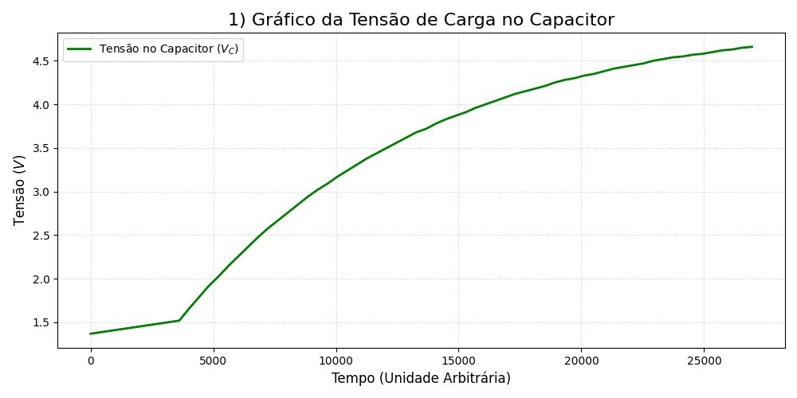
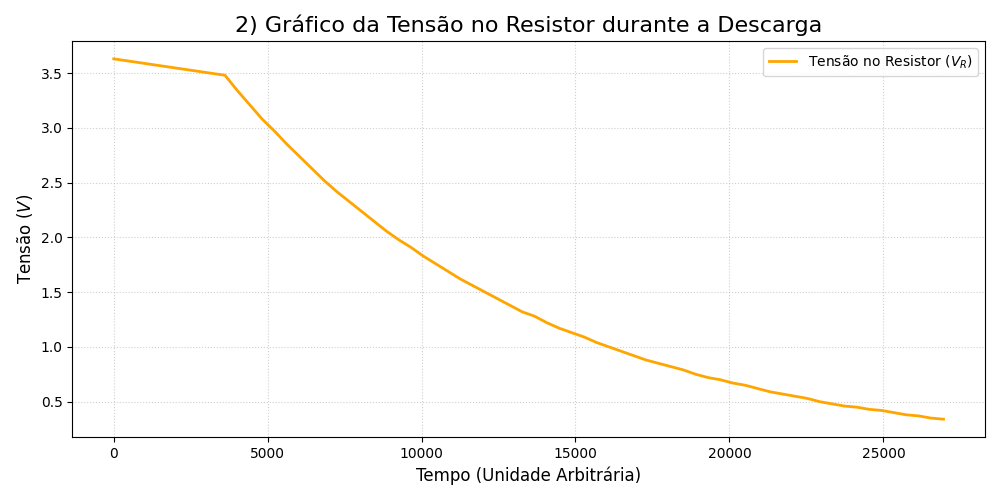
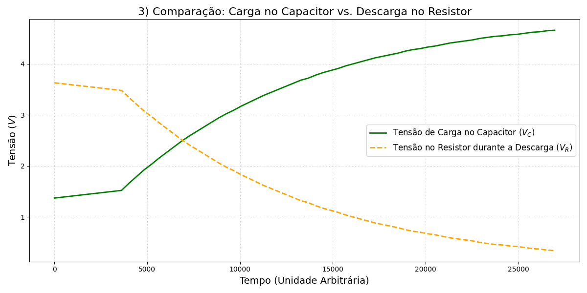

# Projeto: Análise do Circuito RC - Carregamento e Descarregamento do Capacitor

Este documento detalha o processo de coleta e análise dos dados de tensão (Voltagem) obtidos em um circuito RC (Resistor-Capacitor), focando nas curvas de carregamento e descarregamento do capacitor.

## 1. Requisitos do Projeto

O objetivo principal deste projeto foi processar os dados brutos do circuito e gerar os seguintes gráficos para análise:

1. **Gráfico da Carga no Capacitor ($V_C$):** Visualizar a curva de crescimento exponencial da tensão no capacitor.
2. **Gráfico da Descarga no Resistor ($V_R$):** Visualizar a curva de decaimento exponencial da tensão no resistor durante o processo de descarga.
3. **Comparação:** Gerar um único gráfico contendo as duas curvas acima para análise comparativa.

## 2. Configuração e Dependências

O processamento e a plotagem dos dados foram realizados utilizando a linguagem Python com as seguintes bibliotecas:

* **`pandas`:** Para manipulação e estruturação dos dados brutos.
* **`matplotlib`:** Para a geração e visualização dos gráficos.

Para rodar o código, certifique-se de que ambas as bibliotecas estão instaladas:

```bash
pip install pandas matplotlib
```

## 3. Estrutura dos Dados

Os dados brutos foram fornecidos em formato de texto, onde cada linha representa uma medição no tempo.

| Coluna | Descrição | Comportamento na Análise |
| :---: | :---: | :--- |
| **1** | `Tempo` (Unidade Arbitrária) | Eixo X. |
| **2** | `Curva Decrescente` | Tensão no Resistor durante a Descarga ($\approx 3.63V \to 0.34V$). |
| **3** | `Curva Crescente` | Tensão no Capacitor durante a Carga ($\approx 1.37V \to 4.66V$). |

**Atenção:** Baseado no comportamento dos valores, a Coluna 3 foi usada para a Carga ($V_C$) e a Coluna 2 para a Descarga ($V_R$).

## 4. Código Python para Geração dos Gráficos

O script abaixo executa as três etapas de plotagem solicitadas, gerando os arquivos ``grafico_carregamento.png``, ``grafico_descarregamento.png`` e ``grafico_comparacao.png``.

```python
import pandas as pd
import matplotlib.pyplot as plt
from io import StringIO
import os 

# Define o nome da pasta para salvar os gráficos
OUTPUT_DIR = 'graficos_rc'
os.makedirs(OUTPUT_DIR, exist_ok=True) # Cria a pasta se não existir

# Bloco de Dados Brutos
dados_str = """
6 3.63 1.37
3618 3.48 1.52
4021 3.34 1.66
4423 3.21 1.79
4825 3.08 1.92
5227 2.97 2.03
5629 2.85 2.15
6032 2.74 2.26
6434 2.63 2.37
6836 2.52 2.48
7238 2.42 2.58
7641 2.33 2.67
8043 2.24 2.76
8445 2.15 2.85
8847 2.06 2.94
9249 1.98 3.02
9652 1.91 3.09
10054 1.83 3.17
10457 1.76 3.24
10859 1.69 3.31
11260 1.62 3.38
11663 1.56 3.44
12065 1.50 3.50
12468 1.44 3.56
12870 1.38 3.62
13273 1.32 3.68
13675 1.28 3.72
14077 1.22 3.78
14480 1.17 3.83
14882 1.13 3.87
15285 1.09 3.91
15686 1.04 3.96
16089 1.00 4.00
16491 0.96 4.04
16893 0.92 4.08
17296 0.88 4.12
17698 0.85 4.15
18101 0.82 4.18
18503 0.79 4.21
18906 0.75 4.25
19308 0.72 4.28
19709 0.70 4.30
20112 0.67 4.33
20514 0.65 4.35
20917 0.62 4.38
21319 0.59 4.41
21722 0.57 4.43
22124 0.55 4.45
22526 0.53 4.47
22929 0.50 4.50
23331 0.48 4.52
23733 0.46 4.54
24135 0.45 4.55
24538 0.43 4.57
24940 0.42 4.58
25342 0.40 4.60
25745 0.38 4.62
26147 0.37 4.63
26550 0.35 4.65
26952 0.34 4.66
"""

# Carregar e Renomear as Colunas
df = pd.read_csv(
    StringIO(dados_str),
    sep='\s+',
    header=None,
    names=['Tempo', 'Tensao_Descarga_R', 'Tensao_Carga_C']
)

# --- GRÁFICO 1: CARREGAMENTO (Requisito 1) ---
plt.figure(figsize=(10, 5))
plt.plot(
    df['Tempo'],
    df['Tensao_Carga_C'],
    label='Tensão no Capacitor ($V_C$)',
    color='green',
    linewidth=2
)
plt.title('Gráfico de Carga no Capacitor', fontsize=16)
plt.xlabel('Tempo (Unidade Arbitrária)', fontsize=12)
plt.ylabel('Tensão ($V$)', fontsize=12)
plt.legend()
plt.grid(True, linestyle=':', alpha=0.6)
plt.tight_layout()
plt.savefig(os.path.join(OUTPUT_DIR, 'grafico_carregamento.png'))
# plt.show() # Descomentar se quiser ver na tela

# --- GRÁFICO 2: DESCARREGAMENTO (Requisito 2) ---
plt.figure(figsize=(10, 5))
plt.plot(
    df['Tempo'],
    df['Tensao_Descarga_R'],
    label='Tensão no Resistor ($V_R$)',
    color='orange',
    linewidth=2
)
plt.title('Gráfico de Tensão no Resistor (Descarga)', fontsize=16)
plt.xlabel('Tempo (Unidade Arbitrária)', fontsize=12)
plt.ylabel('Tensão ($V$)', fontsize=12)
plt.legend()
plt.grid(True, linestyle=':', alpha=0.6)
plt.tight_layout()
plt.savefig(os.path.join(OUTPUT_DIR, 'grafico_descarregamento.png'))
# plt.show() # Descomentar se quiser ver na tela

# --- GRÁFICO 3: COMPARAÇÃO (Requisito 3) ---
plt.figure(figsize=(12, 6))

plt.plot(
    df['Tempo'],
    df['Tensao_Carga_C'],
    label='Tensão de Carga no Capacitor ($V_C$)',
    linestyle='-',
    linewidth=2,
    color='green'
)

plt.plot(
    df['Tempo'],
    df['Tensao_Descarga_R'],
    label='Tensão no Resistor durante a Descarga ($V_R$)',
    linestyle='--',
    linewidth=2,
    color='orange'
)

plt.title('Comparação: Carga no Capacitor vs. Descarga no Resistor', fontsize=16)
plt.xlabel('Tempo (Unidade Arbitrária)', fontsize=14)
plt.ylabel('Tensão ($V$)', fontsize=14)
plt.legend(fontsize=12, loc='center right')
plt.grid(True, linestyle=':', alpha=0.6)
plt.tight_layout()
plt.savefig(os.path.join(OUTPUT_DIR, 'grafico_comparacao.png'))
# plt.show() # Descomentar se quiser ver na tela

print(f"Três gráficos gerados e salvos na pasta '{OUTPUT_DIR}/'.")

```

## 5. Resultados e Análise

Após a execução do script Python, os gráficos foram gerados e salvos na pasta `graficos_rc` com os seguintes nomes, atendendo a cada requisito:

| Arquivo Gerado | Requisito da Atividade | Curvas Plotadas | Link (Exemplo) |
| :--- | :--- | :--- | :--- |
| `grafico_carregamento.png` | 1) Carga no Capacitor | Apenas a curva crescente ($V_C$) | [Visualizar Carga](graficos_rc/grafico_carregamento.png) |
| `grafico_descarregamento.png` | 2) Descarga no Resistor | Apenas a curva decrescente ($V_R$) | [Visualizar Descarga](graficos_rc/grafico_descarregamento.png) |
| `grafico_comparacao.png` | 3) Comparação dos Gráficos | Curva $V_C$ e Curva $V_R$ juntas | [Visualizar Comparação](graficos_rc/grafico_comparacao.png) |

A análise do gráfico de comparação reforça que as curvas de carga e descarga são **exponenciais e complementares**. Ambas são regidas pela mesma **constante de tempo ($\tau = R \cdot C$)** do circuito, o que garante a simetria entre o processo de crescimento ($V_C$) e o de decaimento ($V_R$).

## 6. Visualização dos Resultados e do Circuito

Esta seção apresenta os gráficos gerados pelo script Python e uma imagem do circuito RC implementado fisicamente.

### 6.1. Gráficos de Análise (Processamento de Dados)

#### Gráfico 1: Carregamento do Capacitor ($V_C$)

Visualização da curva exponencial de crescimento da tensão no capacitor.



#### Gráfico 2: Tensão no Resistor durante a Descarga ($V_R$)

Visualização da curva exponencial de decaimento da tensão medida no resistor durante o ciclo de descarga.



#### Gráfico 3: Comparação das Curvas

Sobreposição das curvas de carga e descarga, destacando a relação exponencial e a complementaridade dos processos.



### 6.2. Implementação Física do Circuito

A imagem a seguir mostra o circuito RC montado na protoboard, conforme utilizado para a coleta dos dados.


---
*Nota: Certifique-se de que a foto do circuito real esteja salva na pasta `imagens/` (ou ajuste o caminho do arquivo `imagens/circuito_rc_real.jpg` conforme a localização real da sua foto).*